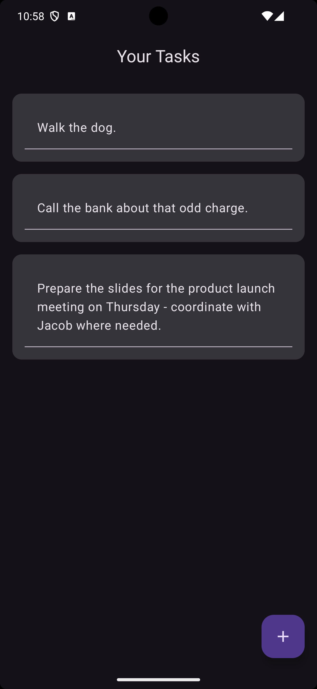
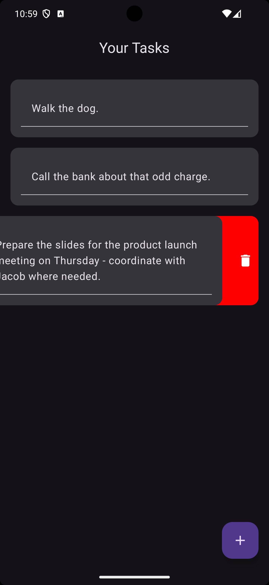
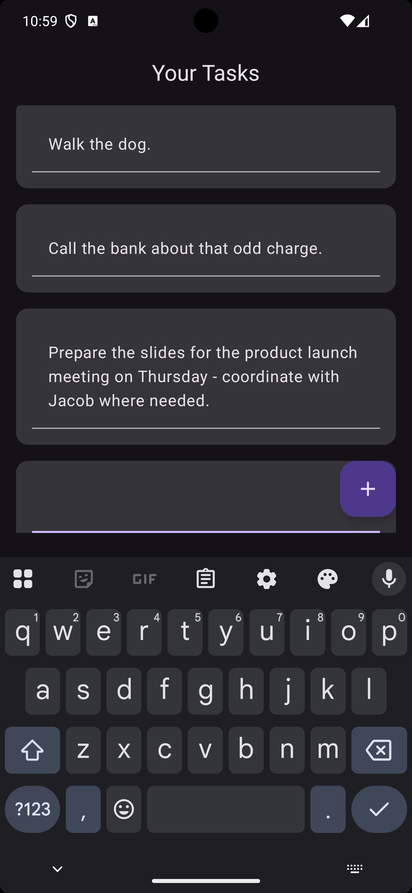

# Android Teaching Material - To-do App

This project aims to present a simple introduction into Android development using Kotlin and Compose. You will create a 'to-do' style app that allows you to enter some text for your to-do item, add additional items as needed and remove items once they have been completed.

The complete example code is available on the 'complete-example' branch - you should pull the 'start-here' branch to get started, which will provide a preconfigured Android Studio project with all the dependencies you'll need.

#### By the end of this project, you'll have an app that looks something like this:

